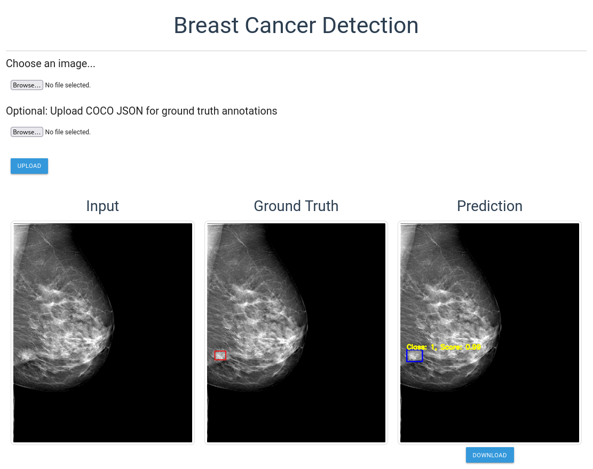

# Breast_Cancer_Detection
Experimenting with public breast cancer mammography datasets (InBreast, MIAS, CBIS-DDSM).
Deep learning project focused on mammography screening and expert aid.

## Features
* **Deep learning model** for mass detection (using Detectron2 and Ultralytics)
  * API
  * Web GUI
  * Train and evaluate
* **Explainable AI**
  * ResNet
  * API
* **Chatbot** LLM API
  * Combining previous model prediction with expert opinion
* **Radiomics**
  
# Prerequisites
* Nvidia CUDA drivers
  * Install a PyTorch compatible version of CUDA from:
    * Your Linux repository
    ```commandline
    apt install nvidia-cuda-toolkit
    ```
    * NVIDIA website for Windows and Linux
      * [Link to download page](https://developer.nvidia.com/cuda-downloads)
* Pytorch with CUDA support
  * Visit [PyTorch website](https://pytorch.org/get-started/locally/) for more information

These two must be installed __manually__ or else will break installation of other requirements later on.   

# Datasets

Supported datasets:
* InBreast
* CBIS-DDSM (Curated Breast Imaging Subset of DDSM)
* MIAS (Mammography Image Analysis Society)

Supported models:
* Generally supported models
  * Faster R-CNN (Detectron)
  * YOLO
  * Any model that supports YOLO / COCO style dataset
* Customized [UaNet](https://github.com/uci-cbcl/UaNet/) for 2D mammography images

## Download
### Google Colab
* Use download_datasets_colab.ipynb jupyter notebook in Google Colab to download all datasets.
* You will need to upload your _'kaggle.json'_ when the notebook gives you an upload dialog.
* After logging in to kaggle, you can get your kaggle json in API section of https://www.kaggle.com/settings.
* The notebook will clone this repository and download all datasets.
### Manual
Dataset links:
* https://www.kaggle.com/datasets/ramanathansp20/inbreast-dataset
* https://www.kaggle.com/datasets/awsaf49/cbis-ddsm-breast-cancer-image-dataset
* https://www.kaggle.com/datasets/kmader/mias-mammography

Download the above datasets and after cloning this repository, create the following directories:
* breast_cancer_detection/
  * datasets/
    * all-mias/
      * mdb001.pgm
      * ...
    * CBIS-DDSM/
      * csv/
      * jpeg/
    * INbreast Release 1.0/
      * AllDICOMs/
      * ...

Copy datasets to directories accordingly.

## Visualizer
After converting the datasets to COCO / YOLO style in the next section (Usage),
you may visualize the standardized dataset using the following methods.
### COCO Style dataset
```bash
python visualizer.py -m coco -d train/images -l train.json 
```
### YOLO Style dataset
```bash
python visualizer.py -m yolo -d train/images -l train/labels 
```


# Usage
**1. Clone this repository**
```bash
git clone https://github.com/monajemi-arman/breast_cancer_detection
```
**2. Install prerequisites**
```bash
cd breast_cancer_detection
pip install --no-build-isolation -r requirements.txt
```
**2. Download the following datasets**  
https://www.kaggle.com/datasets/ramanathansp20/inbreast-dataset  
https://wiki.cancerimagingarchive.net/pages/viewpage.action?pageId=22516629  
https://www.kaggle.com/datasets/kmader/mias-mammography  

**3. Move dataset files**  
First create 'datasets' directory:
```bash
mkdir datasets/
```
Then, extract and move the files to this directory so as to have the following inside datasets/:  
* INbreast Release 1.0/
* CBIS-DDSM/
* all-mias/

**4. Convert datasets to YOLO (and COCO) format**
```bash
python convert_dataset.py
```
After completion, images/, labels/, dataset.yaml, annotations.json would be present in the working directory. 

**5. (optional) Apply additional filters to images**  
If necessary, you may apply these filters to images using our script: _canny, clahe, gamma, histogram, unsharp  
You may enter one of the above filters in command line (-f). 
```python
python filters.py -i PATH_TO_IMAGE_DIRECTORY -o OUTPUT_IMAGE_DIRECTORY -f FILTER_NAME
```
---
# Detectron (Faster R-CNN)
## Train
The purpose of detectron.py is to train and evaluate a Faster R-CNN model and predict using detectron2 platform.
```bash
python detectron.py -c train
```
## Predict
* Visualize model prediction
* Show ground truth and labels
* Filter predictions by confidence score
``` bash
# After training is complete
python detectron.py -c predict -w output/model_final.pth -i <image path>
# -w: path to model weights
```


## Web Application
### Usage
1. Run train step as explained above
2. Copy 'detectron.cfg.pkl' and the last model checkpoint to webapp/ directory.  
\* Last model checkpoint file name is written in output/last_checkpoint
3. Run the following:
```bash
cd webapp/
python web.py
```
4. Then visit http://127.0.0.1:33517
  


5. (optional) Use **API**  
If you wish, API is also available, example:
```bash
# Run server
cd webapp/
python web.py

# Get predictions
curl -X POST \
  -F "file=@input.jpg" \
  http://localhost:33517/api/v1/predict \
  | jq -r '.data.inferred_image' | base64 --decode > prediction.jpg
  
# You may also pass several files for batch prediction
curl -X POST \
  -F "file=@sample1.jpg" \
  -F "file=@sample2.jpg" \
  http://localhost:33517/api/v1/predict  # Returns prediction array
```

## Evaluate
### Evaluation using COCOEvaluator
* Calculate mAP
* Uses test dataset by default
```bash
python detectron.py -c evaluate -w output/model_final.pth
```

### Save predictions in COCO style JSON (optional)
* Suitable for later offline metrics calculation
* All predictions of the test dataset will be written to predicions.json
* Follows COCO format
```bash
python detectron.py -c evaluate_test_to_coco -w output/model_final.pth
```
---
# Explainable AI
First you must train classification model on the data.  
The datasets contain data suitable for object detection. Therefore, you must first convert into classification dataset:
* **Convert dataset for classification**
```bash
python coco_to_classification.py train.json train_class.json
```
* **Train classification model** 
```bash
python classification_model.py -a train_class.json -d train/images --save_dir classification_output -c train
```

* **Generate XAI**
```bash
python classification_model.py --save_dir classification_output -c predict -i train/images/cb_1.jpg
```

* **Run & Test API**
```bash
python classification_model.py --save_dir classification_output -c api

# Save sample to heatmap.jpg
curl -X POST -F "file=@test/images/20586986.jpg" http://localhost:33519/predict | jq -r '.activation_map' | base64 -d >~/heatmap.jpg
```

---

# LLM API
* **Setup config**  
Inside llm/ directory, create _'config.json'_ based on _'config.json.default'_ template.
  

* **Run & Test LLM API**
```bash
python llm/llm_api_server.py

curl -X POST http://localhost:33518/generate-response \                  
-H "Content-Type: application/json" \
-d '{
  "prompt": "What is BI-RADS 4?", "predictions": "Some preds"
}'
```

---
# YOLO
## Training
* Install Ultralytics
```bash
pip install ultralytics
```
* Train your desired YOLO model
```bash
yolo train data=dataset.yaml model=yolov8n

```
## Prediction
Example of prediction using YOLO ultralytics framework:
```bash
yolo predict model=runs/detect/train/weights/best.pt source=images/cb_1.jpg conf=0.1 
```
---
# UaNet (Deprecated)
## Training
* Clone UaNet repository (patched)
```bash
# Make sure you cd to breast_cancer_detection first
# cd breast_cancer_detection
git clone https://github.com/monajemi-arman/UaNet_2D
```
* Prepare dataset
```bash
# Convert datasets to images/ masks/
python convert_dataset.py -m mask
# Convert to 3D NRRD files
python to_3d_nrrd.py
```
* Move dataset to model directory
```bash
# While in breast_cancer_detection directory
mv UaNet-dataset/* UaNet_2D/data/preprocessed/
# Remove old default configs of UaNet
mv split/* UaNet_2D/src/split/
```
* Start training
```bash
cd UaNet_2D/src
python train.py
```